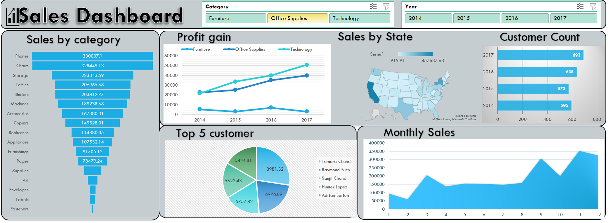

# 📊 Excel Sales Dashboard

## 📌 Project Overview
This project presents an interactive sales dashboard created using Microsoft Excel.  
The dashboard analyzes product category performance and overall sales trends using pivot tables and visual charts.

---

## 🧰 Tools Used

- Microsoft Excel  
- Pivot Tables  
- Charts & Visualizations  

---
## 🔍 Key Features

- Category-wise sales analysis  
- Pivot table based summaries  
- Interactive Excel dashboard  
- Visual representation of sales performance  
- Business insights from raw sales data  

---
## 📊 Insights

- Identified top-performing product categories  
- Compared sales across categories  
- Visualized overall sales distribution  

---
## 🚀 What I Learned

- Building dashboards in Excel  
- Using pivot tables for analysis  
- Creating professional charts  
- Extracting business insights from data  

---

